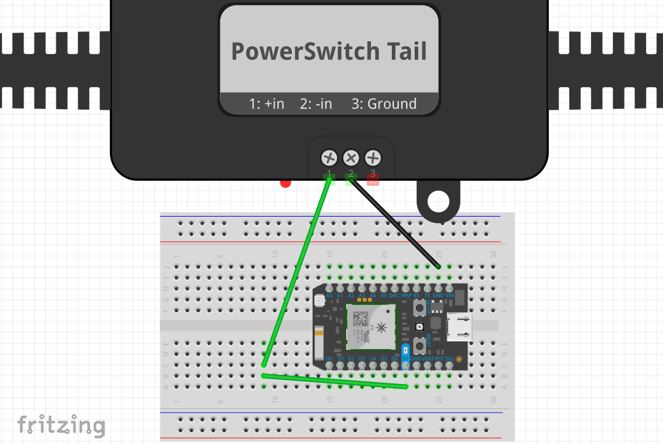

# Photon PowerSwitch Tail II

*Have you tried turning it off and on again?* Before they installed fiber in our neighborhood, I was using Comcast. Our cable modem would stop working at least once or twice per month causing our internet to go down. Power cycling the modem and wireless router usually did the trick to get us back online.

In this project, the Photon core check for an active internet connection. If it detects a lose in internet, it uses the PowerSwitch Tail II to power cycle the modem and router.

### Required Parts

- [PowerSwitch Tail II](https://www.amazon.com/POWERSWITCHTAIL-COM-PowerSwitch-Tail-II/dp/B00B888VHM) $33
- [Photon Core](https://store.particle.io/) $19.00
- [Power Strip](https://www.amazon.com/FosPower-3-Outlet-Wraparound-Extension-Adapter/dp/B06XDJHXVB/) $10.99
- [Breadboard](https://www.sparkfun.com/products/12002) $4.95
- Misc wires for hookup $2

**Total Project Cost: ~$69.94 + tax & shipping costs**

> NOTE: There is a newer switch available at SparkFun that has more features than the PowerSwitch Tail II. I'd recommend using the [IoT Relay](https://www.sparkfun.com/products/14236) for $26.95 instead.

## Considerations

After using this code for seven months without any issue, I came home to my WiFi router having gone through a factory reset. I had the auto update firmware setting turned on and my initial code triggered a reboot after 60 seconds. I've increased the minimum reboot time in this example to 4 minutes but you may want to turn off your routers auto update settings to be safe.

This example relies on the Particle cloud being up. If the Particle cloud is down, the device will think you don't have internet. It's only gone down for me once in the past year but it's something else to keep in mind.

## Wiring



## Code

By default the Photon only operates when there is an internet connection. In this example, we'll want the Photon core to work even if there isn't any internet. To do this we'll set the system mode to `SYSTEM_MODE(SEMI_AUTOMATIC);` and enable system threading `SYSTEM_THREAD(ENABLED);`.

```C++
// Boot up even if unable to connect to the cloud
SYSTEM_MODE(SEMI_AUTOMATIC);
SYSTEM_THREAD(ENABLED);
int retryCount = 0;

void setup()
{
  pinMode(D7, OUTPUT);
  digitalWrite(D7, HIGH); // Turn power on

  Particle.connect();
  waitFor(Particle.connected, 15000);
}

void loop()
{
    // Check for connection
    if(Particle.connected() == false) {
        if(retryCount == 0) {
           delay(240000); // Delay 4 minutes the first time without reset for good measure
        } else {
            digitalWrite(D7, LOW); // Turn power off
            delay(4000); // Wait for 4 seconds
            digitalWrite(D7, HIGH); // Turn power on

            if (retryCount < 2) {
                delay(1000*60*5); // Delay 5 minutes the first two tries
            } else if (retryCount < 4) {
                delay(1000*60*30); // Delay 30 minutes the second two tries
            } else if (retryCount < 12) {
                delay(1000*60*60*2); // Delay 2 hours the final eight tries
            } else {
                // Give up
            }
        }
        // Increase the retry count by one
        retryCount = retryCount + 1;
    } else {
        // We're connected, reset the retryCount to zero
        retryCount = 0;
    }
    delay(30000); // Wait 30 seconds
}
```

## Resources

- [PowerSwitch Tail II and Arduino](http://techvalleyprojects.blogspot.com/2012/04/powerswitch-tail-ii-and-arduino.html)
